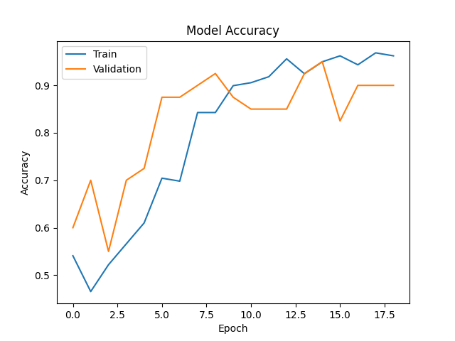
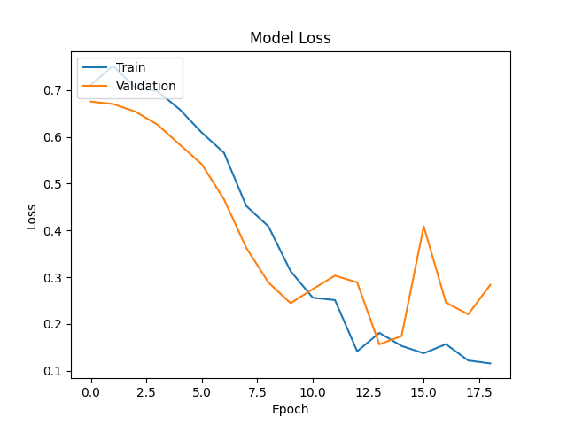

 Burns and Cuts Classifier

## Overview
This project is focused on developing a machine learning model to accurately classify images into two categories: Burns and Cuts. Utilizing the power of Convolutional Neural Networks (CNN) with a fine-tuned VGG16 model, we aim to assist in the preliminary assessment of injuries.

## Role in the Smart Med Kit IoT Project
The model is pivotal in the Smart Med Kit, enhancing it beyond a simple collection of first aid items into an intelligent health assistant. It accurately classifies injuries into Burns and Cuts, guiding users on appropriate care steps. This feature is invaluable in urgent situations where professional medical assistance isn't readily available, making the Smart Med Kit a leading solution in IoT healthcare innovations.

## Model Description
Our model is built on the VGG16 architecture, a renowned model known for its effectiveness in image recognition tasks. We fine-tuned the model for our specific task, adjusting the final layers to distinguish between Burns and Cuts with high accuracy. The model was trained on a dataset comprising images of burns and cuts, each meticulously labeled to ensure quality training.

### Training
The model underwent rigorous training, leveraging data augmentation techniques such as rotation, zoom, shear, and flips to enhance the diversity of our training dataset. This approach helps in making the model more robust and capable of understanding various presentations of burns and cuts. 

Training was executed with the following configurations:
- Optimizer: Adam
- Learning Rate: 0.00001
- Loss Function: Binary Crossentropy
- Metrics: Accuracy
- Epochs: Up to 20, with early stopping based on validation loss

### How the Model Works
The model processes an input image through multiple convolutional layers of the VGG16 network, extracting and learning from the features relevant to distinguishing between burns and cuts. After the feature extraction, the model applies the learned information to classify the input as either a burn or a cut.

## Understanding the Results
The model outputs a binary result:
- Closer to 0: The image is classified as a Burn.
- Closer to 1: The image is classified as a Cut.

It's crucial to consider the model's confidence in its prediction, as reflected in how close the output is to 0 or 1. Higher confidence provides more assurance in the accuracy of the classification.

## Accuracy and Loss Plots
Below are the plots showing the model's accuracy and loss over the training and validation phases. These plots are essential for understanding the model's learning behavior and ensuring it is not overfitting or underfitting.

## Conclusion
This model represents a significant step towards automating the initial assessment of burns and cuts, potentially offering quick preliminary analyses in emergency situations. Future work will focus on expanding the dataset, incorporating more diverse injuries, and improving the model's accuracy and robustness.
